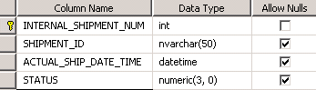
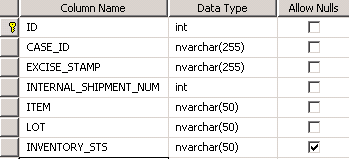
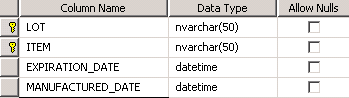
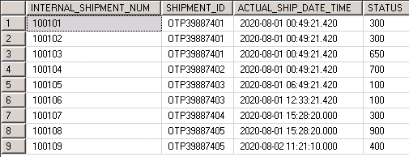
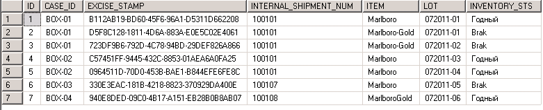
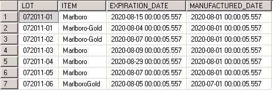

## Тестовое задание 
Пример тестового задания для собеседования на позицию разработчика на технологическом стеке *C#*, *JavaScript*, *SQL*

### **Задание C\#:**

**Классическая задача на знание принципов ООП и умение работать с объектами:**

Построить иерархию классов, описывающих объекты на складе - паллеты и коробки.

Помимо общего набора стандартных свойств (*Id, ширина, высота, глубина, вес*),
паллета может содержать в себе коробки.

У коробки должен быть указан срок годности или дата производства. Если указана
дата производства, то срок годности вычисляется из даты производства плюс *100
дней*.

Срок годности паллеты вычисляется из наименьшего срока годности коробки,
вложенной в паллету. Вес паллеты вычисляется из суммы веса вложенных коробок +
*30кг*.

Объем коробки вычисляется как произведение ширины, высоты и глубины.

Объем паллеты вычисляется как сумма объема всех коробок и произведения ширины,
высоты и глубины паллеты.

***Требуется:***

- Организовать запись и чтение коллекции в/из файл (хотя бы в общем виде). В
случае нехватки времени - описать, как бы вы это реализовали.

- Сгруппировать все паллеты по сроку годности, отсортировать по возрастанию
срока годности, в каждой группе отсортировать паллеты по весу. Результат вывести
на экран.

- Вывести на экран 3 паллеты, которые содержат коробки с наибольшим сроком
годности, отсортированные по возрастанию объема.

---

**Срок выполнения - 2 часа, результат ожидаем на почте в виде архива проекта для
VS2010-2017.**

### **Задание JavaScript:**

1. Используя ресурс https://jsonplaceholder.typicode.com/ получить `json`
содержащий ***500 комментариев***

2. Вывести комментарии в виде таблицы с ограничением в ***10*** одновременно
отображаемых строк

3. Необходима реализация кнопок ***Вперед*** - ***Назад*** и отображение ***текущего номера***
представления (например ***5/50***)

4. Парсинг и вывод `json` должен быть универсальным, т.е. если изменить получаемый
`json` (например вместо комментариев получать посты), никаких изменений в коде,
кроме `url` потребоваться не должно

Должен использоваться только ***JavaScript*** + ***HTML/CSS***

---

**Срок выполнения – 1,5 часа, результат ожидаем на почте в виде архива html + js
файлов**.

### **Задание SQL:**

Есть 3 таблицы:

1.  `dbo.SHIPMENTS` – таблица отгрузок

    

    `Internal_shipment_num` – уникальный номер отгрузки

    `Shipment_id` – имя документа отгрузки

    `Actual_ship_date_time` – время отгрузки

    `Status` – статус отгрузки

2.  `dbo.EXCISE_STAMP` – таблица с коробами/марками

    

    `ID` – номер строки/ключ

    `Case_id` – название короба(1 короб может содержать несколько марок)

    `Excise_stamp` – марка (guid, сгенерированное уникальное значение)

    `Internal_shipment_num` – уникальный номер отгрузки

    `Item` – товар (1 марка = 1 товар)

    `Lot` – партия (одна партия может быть на нескольких товарах)

    `INVENTORY_STS` – статус хранения

3.  `dbo.LOTS` – таблица партий

    

    `LOT` – партия (уникальный ключ по двум полям)

    `ITEM` – товар

    `EXPIRATION_DATE` – дата окончания СГ

    `MANUFACTURED_DATE` – дата производства товара

*Пример данных:*

>   `Shipments` – Отгрузки
>
> 

>   `Excise_stamp` – Марки
>
>

>   `Lots` – Партии
>
>

**Задача:**  
Написать процедуру, входным параметром которой будет `@shelf_life_day` – `int`
(срок годности партии в днях). Процедура должна возвращать все внутренние номера
отгрузок (*`Internal_shipment_num`*), которые находятся в ***статусе ниже 600*** и
содержат как ***минимум 3 разных короба***, в которых присутствует ***хотя бы одна марка***,
срок годности (в днях) которой, ***меньше***, чем передано в параметре.

---

**Срок выполнения – 0,5 часа, результат ожидаем на почте в виде файла.**

***Спасибо и удачи!***
